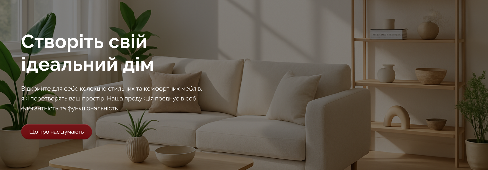

# goit-js-hw-01

# 🛋️ Меблерія — Створюємо простір вашої мрії

<p align="center">
  
</p>

---

## 🎯 Про проєкт

📄 **Live Page:**
[Переглянути проєкт](https://evgeniy-sub8way.github.io/it-creators-project-meblerija/)

**Mebleuria** — це концептуальний ресурс для підбору та замовлення сучасних
меблів. Проєкт реалізований як високопродуктивний лендінг із повною інтеграцією
REST API, складною системою фільтрації та фокусом на ідеальному UX/UI.

Ми створили продукт, який поєднує мінімалістичний дизайн із потужною технічною
базою, забезпечуючи швидке завантаження та плавну взаємодію на будь-яких
пристроях.

---

## 🚀 Ключові можливості (Features)

- **🧩 Динамічний каталог:** Автоматичне завантаження товарів та категорій через
  API.
- **🔍 Розумна фільтрація:** Миттєве сортування меблів без перезавантаження
  сторінки.
- **📦 Поступове завантаження:** Функціонал "Load More" для оптимізації передачі
  даних.
- **🖼️ Retina-Ready:** Адаптація графіки під дисплеї з високою щільністю
  пікселів (x2).
- **✨ Interactive Elements:** \* Адаптивне бургер-меню з блокуванням скролу.
  - Слайдер відгуків (`Swiper.js`) із кастомною логікою округлення рейтингу.
  - Акордеон FAQ для зручного перегляду інформації.
- **📩 Форма замовлення:** Повна валідація даних та інтеграція з системою
  push-сповіщень `iziToast`.

---

## 🛠 Використані технології

[](https://skillicons.dev)

| Компонент      | Технологія / Бібліотека                  |
| :------------- | :--------------------------------------- |
| **Стилізація** | SCSS (BEM Methodology), CSS3 Transitions |
| **Логіка**     | JavaScript (ES6+ Modules), Axios         |
| **Інтерактив** | Swiper.js, Accordion-js, CSS Star Rating |
| **Сповіщення** | iziToast                                 |
| **Збірка**     | Vite                                     |

---

## 📐 Адаптивність та Оптимізація

Проєкт пройшов повний цикл тестування на відповідність макету:

📱 _Mobile First:_ Гумова верстка від 375px.

📟 _Tablet:_ Адаптив від 768px (спеціальне позиціонування бургер-меню).

💻 _Desktop:_ Повнорозмірна версія 1440px.

🟡 _Performance:_ Наявність "лоадерів" під час очікування відповіді від сервера
та обробка помилок (Try/Catch).

---

## 👥 Наша Команда

|                                  Аватар                                   | Розробник                                              | Роль / Секція      |
| :-----------------------------------------------------------------------: | :----------------------------------------------------- | :----------------- |
|  | [Yevhenii Priadko](https://github.com/Evgeniy-sub8way) | **Team Lead**      |
|        | [Mykola Lyashok](https://github.com/MyLyashok)         | **Scrum Master**   |
|    | [Serhii Serdiuk](https://github.com/SerdiukSerhii)     | Furniture Section  |
|    | [Olha Borzynska](https://github.com/OlyaBorzynska)     | Feedback Section   |
|     | [Oleksii](https://github.com/alex-asriian)             | FAQ + Accordion    |
|       | [Yuliia Kozak](https://github.com/YuliaKozak)          | Frontend Developer |
|      | [Viktoria Alexandrova](https://github.com/Vika0605-av) | Frontend Developer |
|         | [Liliia Pastushenko](https://github.com/Liliia-2)      | Frontend Developer |
|    | [Olga Tsasiuk](https://github.com/Olechka-coder)       | Frontend Developer |
|    | [Ivan Shkilnyi](https://github.com/Ivan-Shkilnyi)      | Frontend Developer |

---

## 🏗️ Структура проєкту

**Код організований модульно для зручності підтримки:**

🔹 src/partials/ — HTML-фрагменти (компоненти сторінки).

🔹 src/js/ — JS-модулі для логіки API, модалок та фільтрів.

🔹 src/css/ — стилі компонентів (SCSS).

🔹 public/ — статичні ресурси.

---

## 💡 Супутня інформація

- **Backend API:** Проєкт інтегровано з
  [Furniture Store API](https://furniture-store-v2.b.goit.study/api-docs/).
- **UI Kit:** Використано кастомні рішення для рейтингів та інтерактивних кнопок
  згідно з макетом у Figma.
- **Деплой:** Автоматизовано через GitHub Actions / Pages.

---

## ⚙️ Як запустити проєкт локально

**Клонувати репозиторій:**

```bash
git clone https://github.com/Evgeniy-sub8way/it-creators-project-meblerija.git
```

**Встановити залежності:**

```bash
npm install
```

**Запустити режим розробки:**

```bash
npm run dev
```
